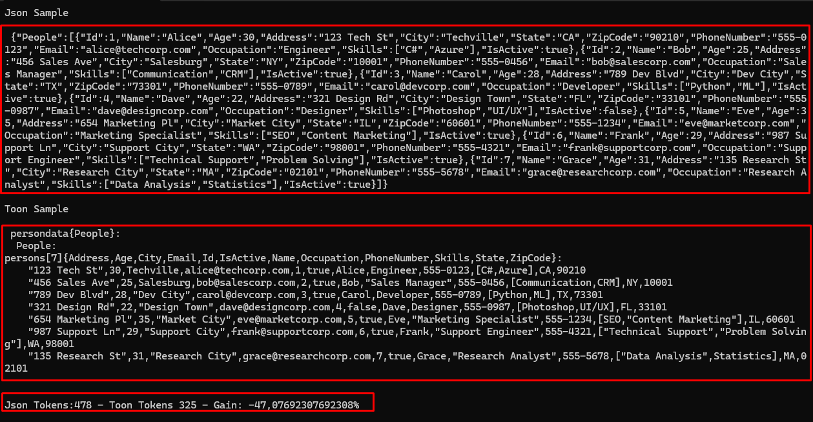

# NIZZOLA.TOON.NET

**Token-Oriented Object Notation (TOON)** serializer for .NET

[](https://www.nuget.org/packages/TOON.NET/)
[](https://opensource.org/licenses/MIT)

## 🚀 Overview

NIZZOLA.TOON.NET is a high-performance serialization library created for AI and LLM workloads. By using a compact, token-oriented format (TOON) it can reduce token usage by roughly **30–60%** compared to JSON. This yields:

- ⚡ Lower API costs when calling LLMs
- 🏃 Faster end-to-end response times
- 📊 Better throughput for flat or tabular data
- 👁️ Human-readable output for debugging and prompts

## 📦 Installation

```bash
dotnet add package Nizzola.TOON.NET
```

## Documentation

This README contains a concise implementation overview and quick reference. See the source code in `src/NizzolaToon/` for API details and examples.

### Implementation (summary)

- 🔧 ToonSerializer — Main static API for Serialize/Deserialize (familiar API surface like `JsonSerializer`).
- ✍️ ToonWriter — Formatting engine that writes TOON with optimized indentation and stream support.
- ⚙️ ToonSerializerOptions — Configuration (naming policies, indentation, tabular detection, async support).
- 🚫 ToonIgnoreAttribute — Attribute to exclude properties from serialization.

### Quick feature overview

- 🧾 Automatic tabularization: detects homogeneous lists and emits a header + rows representation.
- 🔁 Token reduction: minimizes braces/quotes/commas and uses indentation and CSV-like compacting for simple arrays.
- ⚡ Performance: built on `StringBuilder` and optimized reflection paths.
- 🔌 Extensible: attributes and naming policies (CamelCase / snake_case) let you adapt the output to your LLM prompts.

### Example usage

```csharp
// Serialize
var toon = ToonSerializer.Serialize(obj, new ToonSerializerOptions { Indentation = 2, NamingPolicy = NamingPolicy.CamelCase });

// Deserialize
var model = ToonSerializer.Deserialize<MyModel>(toon);

// Streams / async
await ToonSerializer.SerializeAsync(stream, obj, options);
var result = await ToonSerializer.DeserializeAsync<MyModel>(stream);
```

### Quick tips

- Use `Indentation = 2` to balance readability and compactness.
- Enable tabular detection when serializing large homogeneous lists to maximize token savings.
- Align `NamingPolicy` with the conventions your LLM expects (camelCase, snake_case, etc.).

### Short reference

| Symbol | Item | Purpose |
|---|---:|---|
| 🔧 | `ToonSerializer` | Main API (sync/async serialization) |
| ✍️ | `ToonWriter` | Formatting engine and output writer |
| ⚙️ | `ToonSerializerOptions` | Behavioral options and naming policies |
| 🚫 | `ToonIgnoreAttribute` | Exclude properties from serialization |

### Before and after comparison

Case 1 - with single data type


Case 2 - with mixed data types


The more rows an entity has, the greater the token savings with this model.

## Key features

- Tabular data detection: automatically detects lists of objects with identical shape and serializes them as a table (header + rows).
- Token reduction strategies: removes unnecessary braces/quotes/commas, relies on indentation and compact CSV-like arrays for simple sequences.
- Flexible: serializes CLR objects, can convert existing JSON to TOON, and supports streaming/async scenarios.
- Naming policies: compatible with System.Text.Json-style policies (camelCase, snake_case).
- Performance: optimized for throughput using `StringBuilder` and targeted reflection caching.

## ✨ Benefits

- 🎯 Reduce token consumption by ~30–60% compared to JSON when used with LLMs.
- 👨‍💻 Familiar API for .NET developers, easing adoption.
- 🔒 Type-safe usage via generic `Serialize` / `Deserialize` overloads.
- 🔌 Extensible via attributes and options for customization.

This library is prepared for NuGet publication and production use with LLM-powered workflows.

## ☕ Support the project

If you find this library useful and want to support development, consider buying me a coffee:

[](https://www.buymeacoffee.com/nizzola)

Your support helps maintain and improve this open-source project.

## Follow me

[](https://www.linkedin.com/in/nizzola/)
[](https://marcionizzola.medium.com/)
[](https://www.instagram.com/nizzola.dev/)
[](https://linktr.ee/nizzola)
